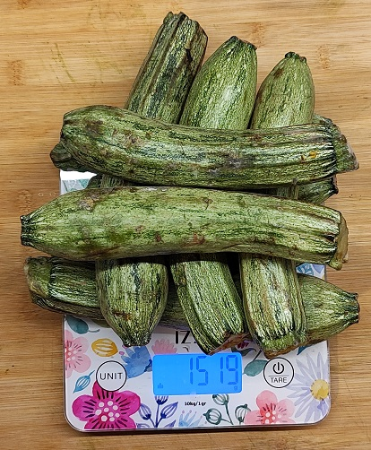

* TOC
{:toc}

# Σάββατο 6 Σεπτέμβρη 2025
---

< Π Ρ Ο Β Λ Ε Ψ Η >

- γιαούρτι 
- μέλι
- ταχίνι
- ομελέτα

- φασολάκια (250 kcal)
- κοτόπουλο
  
- χόρτα (100 kcal)

- φασολάκια (250 kcal)
- κοτόπουλο
- 1 πίτα ολικής (190 kcal)
  
> Στοιχεία

- Ενεργες θερμίδες: 700 kcal
- Βάρος: 97.7 kgr

> Σύνοψη 

- Intake: `1870 kcal`  
- TDEE: `2600 kcal`  

💪🏻 Έλλειμμα: 730 kcal

# Παρασκευή 5 Σεπτέμβρη 2025
---

- preworkout
- 5 φρούτα UFO (400 kcal)
- σοκολάτα 10gr (100kcal)

- ομελέτα
- λάδι
- cottage
- σαλάτα

- 2 φρούτα

- σαλάτα
- κοτόπουλο
- cottage

> Στοιχεία

- Ενεργες θερμίδες: 447 kcal
- Βάρος: 98.2 kgr

> Σύνοψη

- Intake: `2130 kcal`
- ΤDEE: `2347 kcal`

💪🏻 Έλλειμμα: 217 kcal

 

 

 

 

 

# Πέμπτη 4 Σεπτέμβρη 2025
---

- preworkout
- παξιμάδι

- ομελέτα
- 20gr σοκολάτα (100 kcal)

- Κολοκύθι ψητό 1000gr (180 kcal)

- σαλάτα
- κοτόπουλο
- cottage

- 20gr σοκολάτα (100 kcal)
- 50gr cottage (45 kcal)
- παξιμάδι
- λίγες κοτομπουκιές (200 kcal)
- γιαούρτι
- μέλι
- ταχίνι

> Στοιχεία

- Ενεργες θερμίδες: 822 kcal
- Βάρος: 99 kgr

> Σύνοψη

- Intake: `2185 kcal`
- TDEE: `2722 kcal`

💪🏻 Έλλειμμα: 537 kcal

# Τετάρτη 3 Σεπτέμβρη 2025
---

- preworkout
- σοκολατάκι (50 kcal)

- ομελέτα
- γιαούρτι + μέλι

- σαλάτα

- κοτόπουλο
- cottage
- χόρτα
- γιαούρτι + μέλι
- σοκολάτα (550 kcal)
- πατάτα
- πατάτα

> Στοιχεία

- Ενεργες θερμίδες: 330 kcal
- Βάρος: 99,1 kgr

> Σύνοψη

- Intake: `2480 kcal`
- ΤDEE: `2230 kcal`

👎🏻 Έλλειμμα: -250 kcal

 

 

# Τρίτη 2 Σεπτέμβρη 2025
---

- γιαούρτι + μέλι
- ομελέτα

- χόρτα
- Κολοκύθι ψητό 1500gr (250 kcal)

- Σοκολάτα 100γρ (550 kcal)

- κοτόπουλο
- cottage
- σαλάτα
- 50γρ παρμεζάνα

- 20γρ φυστίκια (120 kcal)
- γιαούρτι + μέλι
- 1 σοκολατάκι (50 kcal)

> Στοιχεία

- Ενεργες θερμίδες: 272 kcal
- Βάρος: 98,1 kgr

> Σύνοψη

- Intake: `2340 kcal`
- ΤDEE: `2172 kcal`

👎🏻 Έλλειμμα: -168 kcal

 

 

 

 

 

 

# Δευτέρα 1 Σεπτέμβρη 2025
---
- γιαούρτι + μέλι
- ομελέτα
- αυγό

- Σαλάτα
- 50γρ παρμεζάνα

- γιαούρτι + μέλι
- γιαούρτι + μέλι

- κοτόπουλο
- φασολάκια (200 kcal)
- 2 τσάνος
- χόρτα

- γιαούρτι + μέλι
- 2 παξιμάδια

> Στοιχεία

- Ενεργες θερμίδες: 800 kcal
- Βάρος: 98,8 kgr

> Σύνοψη

- Intake: `2234 kcal`
- TDEE: `2700 kcal`

💪🏻 Έλλειμμα: 466 kcal

 

 

 

 

   

# Κυριακή 31 Αυγούστου 2025
---
- γιαούρτι + μέλι + ταχίνι
- 2 παξιμάδια

- ομελέτα
- χόρτα

- κοτόπουλο
- cottage
- σαλάτα
- ζωμός βοδινού (80 Θ)

- Σαλάτα σπανάκι (100 Θ) + 60γρ παρμεζάνα

- ~~conjac (χωρίς θερμίδες) + ζωμός βοδινού (80Θ)~~ (το πέταξα)
- τυλιχτό emergency με κοτομπουκιές 220 Θ, πίτα ολικής 190 Θ, γιαούρτι + ντομάτα 50 Θ

> Στοιχεία

- Ενεργες θερμίδες: 139 kcal
- Βάρος: 98.4 kgr

> Σύνοψη

- Intake: `2110 kcal`
- ΤDEE: `2039 kcal`

👎🏻 Έλλειμμα: -71 kcal

 

 

 

# Σάββατο 30 Αυγούστου 2025
---
- γιαούρτι + μέλι + ταχίνι
- ομελέτα

- χόρτα

- κοτόπουλο
- cottage
- σαλάτα
- γιαούρτι + μέλι

- γιαούρτι + μέλι + ταχίνι
- γιαούρτι + μέλι + ταχίνι
- 2 παξιμάδια
- Χόρτα

> Στοιχεία

- Ενεργες θερμίδες: 80 kcal
- Βάρος: 98.2

> Σύνοψη

- Intake: `2030 kcal`
- TDEE: `1980 kcal`

👎🏻 Έλλειμμα: -50 kcal

# Παρασκευή 29 Αυγούστου 2025
---
- γιαούρτι + μέλι + ταχίνι

- ομελέτα
- cottage
- preworkout

- κοτόπουλο
- cottage
- σαλάτα
- γιαούρτι + 2x μέλι
- 2x μέλι

- γιαούρτι + 2x μέλι + ταχίνι
- 4 παξιμάδια

> Στοιχεία

- Ενεργες θερμίδες: 1392 kcal
- Βάρος: 98.2 kg

> Σύνοψη

- Intake: `2410 kcal`
- ΤDEE: `3292 kcal`

💪🏻 Έλλειμμα: 882 kcal

 

# Πέμπτη 28 Αυγούστου 2025
---
- ομελέτα

- κοτόπουλο
- cottage
- σαλάτα

- κοτόπουλο
- cottage
- σαλάτα
- γιαούρτι + μέλι + ταχίνι

- γιαούρτι + μέλι + ταχίνι
- 2 παξιμάδια

> Στοιχεία

- Ενεργες θερμίδες: 950 kcal
- Βάρος: 98 kg

> Σύνοψη

- Intake: `1880 kcal`
- ΤDEE: `2850 kcal`

💪🏻 Έλλειμμα: 970 kcal

# Τετάρτη 27 Αυγούστου 2025
---
- 2 παξιμάδια
- φέτα τυρί του τόστ
- ομελέτα

- κοτόπουλο
- cottage
- σαλάτα

- κοτόπουλο
- cottage
- σαλάτα
- ζωμός
- 4 τσάνος
- γιαούρτι + μέλι + ταχίνι

- γιαούρτι + μέλι + ταχίνι
- παξιμάδι
- φέτα τυρί του τόστ

> Στοιχεία

- Ενεργες θερμίδες 962 kcal
- Βάρος: 98.9 kg

> Σύνοψη

- Intake: 2418 kcal
- ΤDEE: 2862 kcal

- Έλλειμμα: 444 kcal

# Τρίτη 26 Αυγούστου 2025
---
- 2 παξιμάδια
- 2 αυγά
- ομελέτα
- λάδι
- cottage

- σαλάτα
- κοτόπουλο

- σαλάτα
- κοτόπουλο
- cottage

- γιαούρτι
- 2 παξιμάδια
- 2 φέτες τυρί για τόστ
- αμυγδαλόγαλο

> Στοιχεία

- Ενεργες θερμίδες 463 kcal
- Βάρος: 99 kg

> Σύνοψη

- Intake: 1980 kcal
- ΤDEE: 2363 kcal

- Έλλειμμα: 383 kcal

# Δευτέρα 25 Αυγούστου 2025
---
- 2 παξιμάδια
- μέλι
- ταχίνι
- 2 αυγά
- πατάτες
- ομελέτα
- λάδι

- κοτόπουλο
- cottage
- σαλάτα

- preworkout

- κοτόπουλο
- cottage
- σαλάτα μεγάλη
- μέλι
- μακαρονάκι νερόβραστο (200 kcal)
- καρύδια

> Στοιχεία

- Ενεργες θερμίδες: 1300 kcal
- Βάρος: 99.3 kg

> Σύνοψη

- Intake: 2760 kcal
- ΤDEE: 3200 kcal

- Έλλειμμα: 440 kcal

# Κυριακή 24 Αυγούστου 2025
---
- γιαούρτι
- μέλι
- 2 αυγά
- ομελέτα
- λάδι

- σαλάτα
- κοτόπουλο
- γαούρτι + μέλι + ταχίνι
- 1 παξιμάδι

- σαλάτα
- μέλι
- κοτόπουλο
- cottage
- πατάτες
- γιαούρτι + μέλι + ταχίνι

> Στοιχεία

- Ενεργες θερμίδες: 716 kcal
- Βάρος: 99.9 kg

> Σύνοψη

- Intake: 2290 kcal
- ΤDEE: 2616 kcal

- Έλλειμμα: 326 kcal

# Σάββατο 23 Αυγούστου 2025
---
- λάδι
- ομελέτα
- preworkout

- λάδι
- σαλάτα
- 30gr τριμμένη παρμεζάνα
- 180gr μοσχαράκι κοκκινιστό (ψητό της κατσαρόλας)
- γιαούρτι + ταχίνι

- 5 τσάνος

- σαλάτα
- 30gr τριμμένη παρμεζάνα
- μέλι
- cottage
- πατάτες
- γιαούρτι + μέλι + ταχίνι
- 5 ρυζογκοφρέτες
- 2 παξιμάδια
- 1 φέτα τυρί για τοστ

> Στοιχεία

- Ενεργες θερμίδες: 445 kcal
- Βάρος: 99.8 kg

> Σύνοψη

- Intake: 2725 kcal
- ΤDEE: 2345 kcal

- Έλλειμμα: -380 kcal

# Παρασκευή 22 Αυγούστου 2025
---
- γιαούρτι + μέλι + ταχίνι
- 2 παξιμάδια
- μια φρυγανιά
- μέλι
- ταχίνι

- σνακ: 400 kcal νωρίς το μεσημέρι (μια ριζογκοφρέτα, ένα κομματάκι γλυκό και λίγο πεπόνι)

- σαλάτα
- πατάτες
- 180gr μοσχαράκι άλιπο κοκκινιστό (κατσαρόλας)

- 180gr μοσχαράκι άλιπο κοκκινιστό (κατσαρόλας)
- σαλάτα + λάδι

- γιαούρτι + μέλι + ταχίνι
- 1 μικρό πικρό αχλάδι
- 2 μπανάνες
- γιαούρτι + μέλι + ταχίνι
- καρύδια
- 3 φρυγανιές
- 1 φέτα τυρί του τόστ

> Στοιχεία

- Ενεργές θερμίδες: 727 kcal
- Βάρος: 99.9 kg

> Σύνοψη

- Intake: 3280 kcal
- ΤDEE: 2627 kcal

- Έλλειμμα: -653 kcal

# Πέμπτη 21 Αυγούστου 2025
---
- 280gr γιαούρτι + μέλι + ταχίνι
- κουλούρι

- ομελέτα
- λάδι

- 2 cottage
- πατάτες

- σαλάτα λάχανο πράσινη χωρίς λάδι
- κοτόπουλο
- cottage
- γιαούρτι + μέλι + ταχίνι
- γιαούρτι + μέλι + ταχίνι
- 3 παξιμαδια
- 1 φετα τυρι του τοστ

> Στοιχεία

- Ενεργες θερμίδες: 789 kcal
- Βάρος: 99.9 kg

> Σύνοψη

- Intake: 2363 kcal
- ΤDEE: 2689 kcal

- Έλλειμμα: 326 kcal

 

# Τετάρτη 20 Αυγούστου:
---
- γιαούρτι + μέλι + ταχίνι
- μπανάνα
- ομελέτα
- λάδι

- σαλάτα
- μελι
- κοτόπουλο
- cottage
- παξιμάδι

- σαλάτα
- κοτόπουλο
- cottage
- 2 παξιμάδια
- γιαούρτι + μέλι + ταχίνι

> Στοιχεία

- Ενεργες θερμίδες: 1000 kcal
- Βάρος 99.8 kg

> Σύνοψη

- Intake: 2380 kcal
- ΤDEE: 2900 kcal

- Έλλειμμα: 520 kcal

# Τρίτη 19 Αυγούστου 2025
---
- γιαούρτι + μέλι + ταχίνι
- ομελέτα

- γιαούρτι + μέλι + ταχίνι
- σνάκ 110 kcal
- σνάκ 400 kcal

- κοτόπουλο
- παξιμάδι
- σαλάτα + λάδι

- αμυγδαλόγαλο + μέλι

> Στοιχεία

- Ενεργες θερμίδες: 305 kcal
- Βάρος 100 kg

> Σύνοψη

- Intake: 1890 kcal
- ΤDEE: 2205 kcal

- Έλλειμμα: 315 kcal

# Δευτέρα 18 Αυγούστου 2025
---

- γιαούρτι + μέλι
- μισό γιαούρτι

- 3 παξιμάδια
- σαλάτα + λάδι, 1 κ.σ. τυρί τριμμένο και 30gr ελλιές ροδέλετες (κάνε προσσέγγιση)
- σολομό ψημένο 120gr, λίγα λαχανικά, και 1 cup πουρέ (κάνε προσέγγιση)

- preworkout

- 3 παξιμάδια
- γιαούρτι + 2x μέλι + ταχίνι
- μισό γιαούρτι
- μισή κούπα δημητριακά + γάλα (κάνε προσσέγγιση)
- σαλάτα

> Στοιχεία

- Ενεργες θερμίδες: 616 kcal
- Βάρος 100 kg

> Σύνοψη

- Intake: 2530 kcal
- ΤDEE: 2516 kcal

- Έλλειμμα: -14 kcal

# Κανόνες

- Χαμηλός γλυκαιμικός δείκτης, περιορισμένοι υδατάνθρακες (κυρίως σύνθετοι, εκτός από το μέλι)
- Υψηλή πρόσληψη πρωτεΐνης
- Περιορισμένα λιπαρά
- Όχι τηγανητών
- Όχι λάδι στο μαγείρεμα
- Ημερήσιος στόχος: θερμιδικό έλλειμμα 500 kcal.

RMR 1900 θερμίδες, Βάρος 100kg, 18 Αυγούστου 2025.

# Πίνακας συντομέυσεων

- αυγό: 80 kcal
- scoop πρωτείνης 115 kcal
- ομελέτα: 220 kcal (250ml ασπράδι 120 kcal + λαχανικά ή/και μανιτάρια 100 kcal)
- φρούτο: 120 kcal (πχ. μπανάνα)
- κουλούρι: Θεσσαλονίκης  225 kcal (80gr, με σουσάμι)
- κοτόπουλο: 300 kcal (ψημένο 180gr στή kcalος)
- ζωμός: 60 kcal (1 cup βοδινός λιπαρός)
- μπιφτέκι: 130 kcal (κοτόπουλο)
- σαλάτα: 100 kcal (με ξύδι, χωρίς λάδι)
- σαλάτα μεγάλη: 150 kcal (με ξύδι, χωρίς λάδι)
- ντάκος: 320 kcal (3 παξιμάδια 3x80 kcal = 240 kcal + 1 ντομάτα μεγάλη, βαλσάμικο)
- γιαούρτι: 140 kcal (200gr 2% λιπαρά)
- παξιμάδι: 80 kcal (ολικής/χαρουπιού)
- cottage 90 kcal (100gr)
- τσάνος: 27 kcal (κράκερ με υψηλό fiber)
- πατάτα: 140 kcal (150gr ψητή χωρίς λάδι)
- λάδι 60 kcal (ελαιόλαδο ωμό)
- μέλι: 40 kcal (1 κ.γ.)
- ταχίνι:  80 kcal (1 κ.γ.)
- βρώμη: 190 kcal (50gr ολικής τρίμα)
- αμυγδαλόγαλο: 60 kcal (250ml χωρίς προσ θήκη ζάχαρης)
- preworkout: 430 kcal (αμυγδαλόγαλο, βρώμη, 2x μέλι, ταχίνι)
- ρυζογκοφρέτα: 40 kcal (1 τεμάχιο)
- καρύδια: μεσαία χούφτα 250 kcal
- Φρυγανιά: 70 kcal
- χόρτα: 100 kcal
- πίτα: 190 kcal (ολικής)

